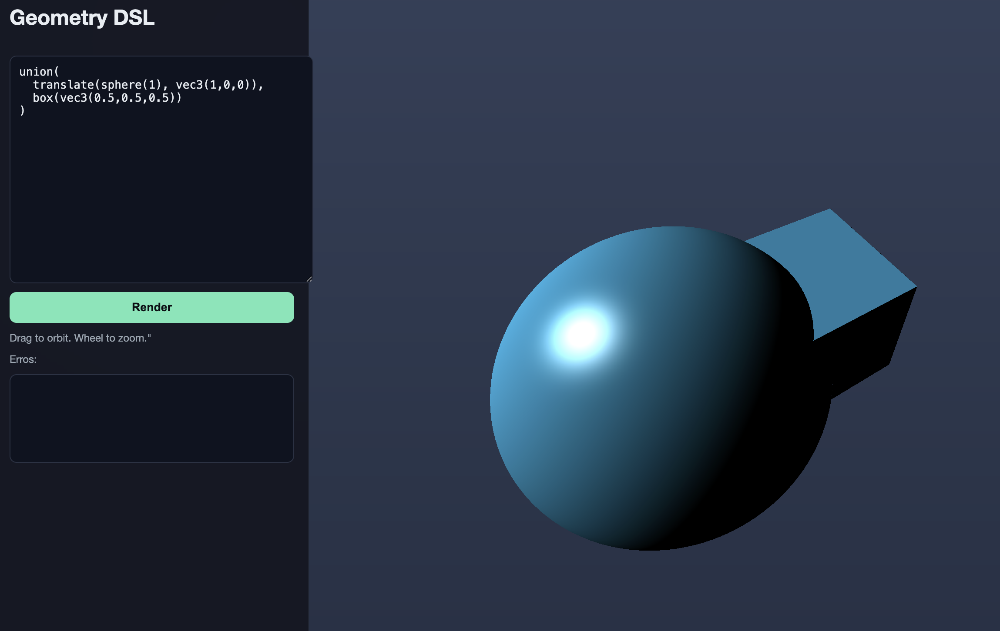

Geometry DSL (educational)

Stages:
- Lexer: dsl_lexer.py
- Parser: dsl_parser.py
- AST: dsl_ast.py
- Type checker: dsl_typecheck.py
- AST interpreter: dsl_interp_ast.py
- IR: dsl_ir.py
- IR interpreter: dsl_interp_ir.py
- GLSL emitter (AST): dsl_glsl.py
- GLSL emitter (IR): dsl_glsl_ir.py
- Tests: main.py

Quick start
1) Run tests
	/Users/saiganesh/dev/geometry-dsl/.venv/bin/python main.py

2) Start backend
	pip install fastapi uvicorn
	/Users/saiganesh/dev/geometry-dsl/.venv/bin/uvicorn server:app --reload

3) Open frontend
	Open index.html in a browser and click Render

Optional manual check
curl -s -X POST http://localhost:8000/eval \
	-H 'Content-Type: application/json' \
	-d '{"code":"sphere(1)","p":[0,0,0]}'
